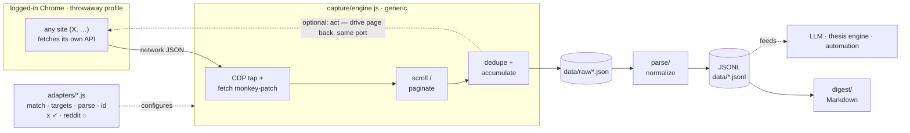

# kache-chrome

Turn a logged-in Chrome session into a private, programmable data feed. Instead
of paying for an API, **eavesdrop on the network calls your own authenticated
browser already makes**, normalize them to JSONL, and (optionally) act back on
the page. The engine is generic — a new site is one small adapter.

> Inspired by [@yacineMTB](https://x.com/yacineMTB) (kache): *"open chrome with a
> developer flag, listen to page creation events, monkey-patch fetch, push data
> back up the port to an outside script."*



## How it works

- **Launch** an isolated Chrome — throwaway profile, loopback-only debug port.
- **Engine** connects over CDP, monkey-patches `fetch`, scrolls to paginate, and
  captures the JSON responses an adapter cares about — deduped + accumulated.
- **Adapters** are the only site-specific code: `match · targets · parse · id`.
- **Out:** clean JSONL for LLMs/automation, plus a Markdown digest for humans.

## Control levels

`1` eavesdrop · `2` park + listen → **safe**  |  `3` crawl → ToS-gray  |  `4` act (post/click) → irreversible, ban risk

## Quickstart

```bash
./launch/safe-debug-chrome.sh                  # isolated debug Chrome
# log into a THROWAWAY account in that window (never your real one)
ADAPTER=x SUBJECT=GavinSBaker npm run capture   # scroll + tap -> data/raw/
ADAPTER=x SUBJECT=GavinSBaker npm run parse     # -> data/GavinSBaker.jsonl
ADAPTER=x SUBJECT=GavinSBaker npm run digest    # -> data/GavinSBaker.digest.md
```

## Add a site

Copy `adapters/x.js`, run capture once, inspect `data/raw/` for the endpoints +
JSON shape, fill in `match`/`parse` (~30–40 lines). See `adapters/reddit.js`.

## Safety

- Dedicated throwaway profile — **never your real / banking session**.
- Debug port binds `127.0.0.1` only; it has no auth, so anything local can drive it.
- Scraping at volume can violate site ToS and lock throwaway accounts.
